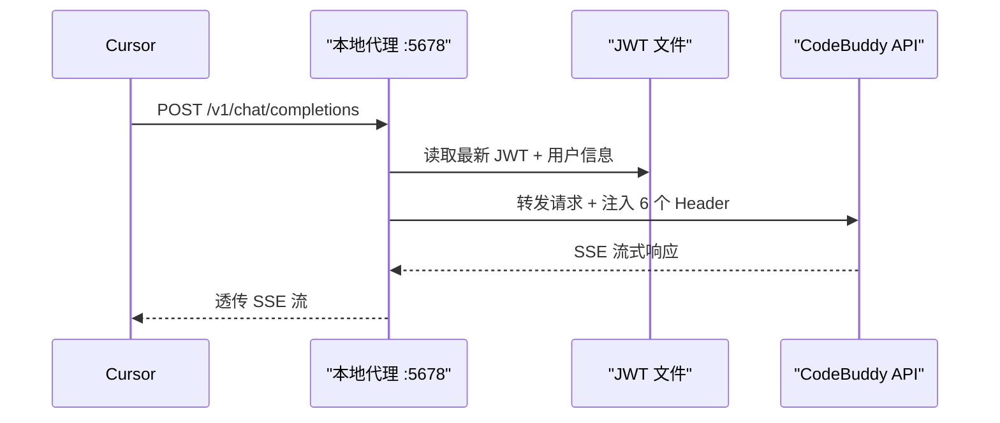

# CodeBuddy 本地代理接入 Cursor

## 数据流




## 实现方案

**文件**: `.cursor/hooks/codebuddy_proxy.py`（与 summarize_session.py 同目录）

纯标准库实现（`http.server` + `urllib.request`），无需安装任何依赖。

### 核心逻辑（约 120 行）

1. **HTTP 服务**: `http.server.HTTPServer` 监听 `localhost:5678`
2. **路由**: 只处理 `POST /v1/chat/completions`，其他返回 404
3. **认证**: 复用 [summarize_session.py](c:\Users\THINKSTATION\Documents\MetaAgent.cursor\hooks\summarize_session.py) 的 `find_codebuddy_auth()` + `_parse_auth_file()` 逻辑（提取为共享模块或直接复制）
4. **转发**: 读取 Cursor 发来的 request body，注入 CodeBuddy headers，转发到 `https://copilot.tencent.com/v2/chat/completions`
5. **流式透传**: CodeBuddy 返回 SSE 流，直接透传给 Cursor（不解析，保持原始 SSE 格式）

### 关键设计决策

- **JWT 每次请求重新读取**: 不缓存 token，每次请求从文件读最新的。文件读取开销极小（<1ms），但保证永远用最新 token。如果读取失败返回 502。
- **流式透传不缓冲**: 使用 chunked transfer，逐块转发 SSE 数据，Cursor 可以实时看到生成过程。
- **不修改 request body**: Cursor 发什么就原样转发（model、messages、stream 等），代理只加 headers。
- **纯标准库**: 零依赖，`py -3 codebuddy_proxy.py` 即可启动。

### Cursor 配置

在 Cursor Settings > API Keys 中：

- 打开 **OpenAI API Key** 开关
- 填入任意字符串作为 API Key（如 `sk-placeholder`）
- 打开 **Override OpenAI Base URL**
- 填入 `http://localhost:5678/v1`

然后在模型列表中添加 `glm-5.0`，即可在 Subagent 的 model 下拉菜单中选择。

### 启动方式

手动启动：

```
py -3 .cursor/hooks/codebuddy_proxy.py
```

后续可考虑：配置为 Windows 开机自启服务，或在 Cursor hooks 中自动检测并启动。