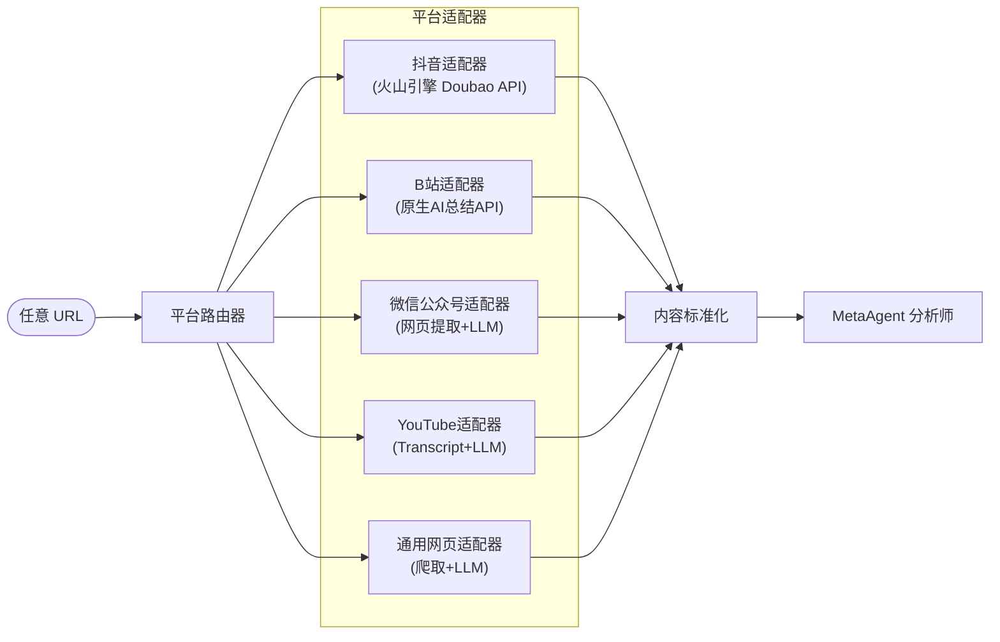

# Content Intelligence Gateway：平台原生 AI 内容提取管线

## 一、核心洞察

你发现了一个重要规律：**内容平台正在内建 AI 能力，而这些 AI 对自家内容有"特权访问"**。

```
传统方式：URL → 下载视频 → 转文字(Whisper) → LLM总结    （慢、贵、复杂）
新方式：  URL → 平台原生AI API → 直接拿到结构化文本      （快、便宜、简单）
```

这不是一个单点需求，而是一个 **可泛化的架构模式**：




## 二、平台原生 AI 可行性矩阵


| 平台             | 原生 AI 能力         | API 可用性                                | 提取策略                             | 成本                             |
| -------------- | ---------------- | -------------------------------------- | -------------------------------- | ------------------------------ |
| **抖音**         | 豆包可直接解析抖音链接      | 火山引擎 Doubao API (OpenAI 兼容)            | 视频理解 / 联网搜索 / 豆包助手               | ~RMB 2.6/次 (Doubao-1.6-Vision) |
| **B站**         | 原生 AI 总结（带时间戳大纲） | `/x/web-interface/view/conclusion/get` | 直接调 B站 API                       | 免费（需登录 cookie）                 |
| **微信公众号**      | 无公开 API          | N/A                                    | 网页爬取 + LLM 总结                    | LLM token 费                    |
| **YouTube**    | 有字幕/转录 API       | YouTube Data API v3                    | 提取 transcript + LLM 总结           | 基本免费                           |
| **小红书**        | 豆包联网可搜索          | 火山引擎联网搜索                               | 联网搜索或网页提取                        | ~RMB 2.6/次                     |
| **Twitter/微博** | 文本原生             | 直接解析                                   | 提取文本 + LLM 分析                    | 极低                             |
| **通用网页**       | N/A              | N/A                                    | `requests` + `readability` + LLM | LLM token 费                    |


**关键发现**：

1. **火山引擎 Doubao API** 是最通用的——它的联网搜索和视频理解能力可以覆盖抖音、小红书等多个字节系/非字节系平台
2. **B站 AI 总结 API** 是免费的隐藏宝藏——直接返回结构化大纲
3. 对于没有原生 AI 的平台，fallback 到"爬取内容 + 通用 LLM 总结"

## 三、统一输出格式

无论来自哪个平台，最终输出标准化为：

```json
{
  "source": {
    "url": "https://www.douyin.com/video/xxx",
    "platform": "douyin",
    "title": "视频标题",
    "author": "作者名",
    "publish_date": "2026-03-13"
  },
  "content": {
    "summary": "一段话总结",
    "outline": [
      {"timestamp": "00:00", "text": "开头引入..."},
      {"timestamp": "01:23", "text": "核心观点..."}
    ],
    "full_text": "完整文本内容...",
    "key_points": ["要点1", "要点2"],
    "tags": ["标签1", "标签2"]
  },
  "extraction": {
    "method": "doubao_video_understanding",
    "model": "doubao-1.6-vision",
    "cost_tokens": 3200,
    "extracted_at": "2026-03-13T10:30:00Z"
  }
}
```

## 四、技术方案

### 4.1 火山引擎 Doubao API 接入

Doubao API 兼容 OpenAI 格式，接入成本很低：

```python
import requests

VOLCENGINE_API_KEY = "your-api-key"
ENDPOINT_ID = "your-endpoint-id"  # 在火山方舟控制台创建

def extract_via_doubao(url: str, question: str = "请总结这个内容") -> dict:
    resp = requests.post(
        "https://ark.cn-beijing.volces.com/api/v3/chat/completions",
        headers={"Authorization": f"Bearer {VOLCENGINE_API_KEY}"},
        json={
            "model": ENDPOINT_ID,
            "messages": [
                {"role": "user", "content": f"请解析并总结以下链接的内容：{url}\n\n{question}"}
            ]
        }
    )
    return resp.json()
```

豆包的**联网搜索**和**豆包助手**工具可以让模型主动访问 URL 并提取内容——这是传统 LLM 做不到的。

### 4.2 B站 AI 总结 API

```python
def extract_bilibili_summary(bvid: str, cookie: str) -> dict:
    aid, cid = get_video_info(bvid)
    # WBI 签名鉴权
    params = wbi_sign({"aid": aid, "cid": cid})
    resp = requests.get(
        "https://api.bilibili.com/x/web-interface/view/conclusion/get",
        params=params,
        headers={"Cookie": cookie}
    )
    return resp.json()
```

### 4.3 平台路由器

```python
import re
from urllib.parse import urlparse

PLATFORM_PATTERNS = {
    "douyin": [r"douyin\.com", r"v\.douyin\.com"],
    "bilibili": [r"bilibili\.com", r"b23\.tv"],
    "wechat": [r"mp\.weixin\.qq\.com"],
    "youtube": [r"youtube\.com", r"youtu\.be"],
    "xiaohongshu": [r"xiaohongshu\.com", r"xhslink\.com"],
    "weibo": [r"weibo\.com", r"m\.weibo\.cn"],
}

def identify_platform(url: str) -> str:
    for platform, patterns in PLATFORM_PATTERNS.items():
        if any(re.search(p, url) for p in patterns):
            return platform
    return "generic"
```

## 五、集成方式（两个选项）

### 选项 A：作为 Cursor Hook/Script

- 新增 `.cursor/hooks/extract_content.py`
- 在 Cursor 中直接调用：用户粘贴 URL → AI 调用脚本 → 返回结构化内容
- 最简单，符合 MetaAgent 现有模式

### 选项 B：作为 MCP Server 工具

- 注册到 system-agent（或独立 MCP Server）中
- 暴露 `extract_content(url, question?)` MCP 工具
- AI 在任何对话中都可调用
- 更通用，但依赖 system-agent 基础设施（尚未实现）

**推荐**：Phase 1 先做选项 A（独立脚本），后续迁移到 MCP。

## 六、文件结构

```
meta/content-gateway/
  ├── gateway.py              # 主入口：URL → 路由 → 提取 → 标准化
  ├── adapters/
  │   ├── __init__.py
  │   ├── doubao.py           # 火山引擎 Doubao API 适配器
  │   ├── bilibili.py         # B站 AI 总结 API 适配器
  │   ├── youtube.py          # YouTube transcript 适配器
  │   ├── wechat.py           # 微信公众号爬取适配器
  │   └── generic.py          # 通用网页提取适配器（readability + LLM）
  ├── config.json             # API keys, cookie 等配置
  └── requirements.txt        # requests, readability-lxml 等
```

## 七、依赖

```
requests           # HTTP 请求
readability-lxml   # 网页正文提取（通用适配器用）
```

核心只需 2 个外部依赖。各平台 API 都是 HTTP REST，不需要专用 SDK。

## 八、扩展性：流程复用

你的核心观察——"如果内容平台都有原生 AI，就可以套用同一条流程"——意味着新增平台只需：

1. 在 `PLATFORM_PATTERNS` 里加一条正则
2. 写一个 `adapters/xxx.py`（通常 < 50 行）
3. 如果平台有原生 AI API → 调 API；没有 → fallback 到通用提取

添加一个新平台的边际成本极低。

## 九、开放问题

1. **火山引擎账号**：是否已有火山引擎账号？需要注册并创建 Doubao API 的推理端点（Endpoint）
2. **B站 cookie**：B站 AI 总结 API 需要登录态 cookie，是否接受这种方式？
3. **优先级**：先实现哪些平台？建议 Phase 1 只做抖音（Doubao）+ B站 + 通用网页
4. **分析深度**：提取到文本后，是直接给 Cursor 中的 AI 分析，还是需要自动存档到 `docs/` 下？

