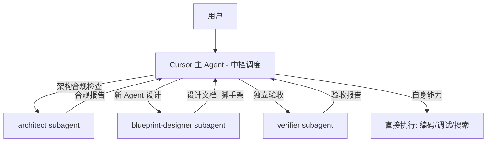

# Cursor Subagent 调度体系设计

## 设计理念

Cursor 扮演 MetaAgent 架构中的"中控 Agent"角色：理解用户意图、拆分任务、派发给专业 Subagent、验收结果。这与 [ARCHITECTURE.md](docs/ARCHITECTURE.md) 第三节的系统总览直接对应：

## 核心原则

- **先少后多**: 首批 3 个 Subagent，验证有效后再扩展（Cursor 官方建议）
- **职责单一**: 每个 Subagent 只做一类事，description 字段精确描述触发时机
- **Skill vs Subagent 分工**: 单步快速任务用 Skill（commit-conventions），需要独立上下文的复杂任务用 Subagent

## 首批 3 个 Subagent

### 1. architect — 架构守护者

**文件**: [.cursor/agents/architect.md](.cursor/agents/architect.md)

- **职责**: 检查变更是否符合 ARCHITECTURE.md 定义的架构规范
- **触发时机**: 新增模块、跨模块改动、提交前审查
- **model**: `fast`（主要是对照检查，不需要深度推理）
- **readonly**: `true`
- **核心能力**:
  - 读取 ARCHITECTURE.md 第十一节（项目结构），验证文件放置位置
  - 检查跨层引用（如 ui/ 直接 import orchestrator/ 内部实现）
  - 检查公开接口是否有 docstring
  - 检查配置值是否硬编码
  - 检查是否违反"第一性原理"中的设计原则

### 2. blueprint-designer — 蓝图设计师

**文件**: [.cursor/agents/blueprint-designer.md](.cursor/agents/blueprint-designer.md)

- **职责**: 设计和生成新 Agent 模块，遵循 ARCHITECTURE.md 第四节 Blueprint DNA
- **触发时机**: 用户说"我需要一个 XX Agent"或"设计新模块"
- **model**: `inherit`（需要深度推理能力来做设计决策）
- **核心能力**:
  - 按自举引擎流程（第六节）执行领域分析
  - 生成 manifest.json（身份证）
  - 搭建 Blueprint 目录结构（core/, tools/, skills/, memory/, reflection/, knowledge/）
  - 生成通用模块（直接复用，不需要领域定制）
  - 为领域特定部分生成骨架代码（接口定义 + TODO）
  - 输出对应的 ADR 文档记录设计决策

### 3. verifier — 验收员

**文件**: [.cursor/agents/verifier.md](.cursor/agents/verifier.md)

- **职责**: 独立验证实现是否完整、功能是否正确
- **触发时机**: 功能实现完成后、标记 TODO 完成前、代码审查时
- **model**: `fast`
- **readonly**: `true`
- **核心能力**:
  - 对照任务描述逐条验证是否真正完成
  - 运行测试、检查语法
  - 检查边界条件和异常路径
  - 验证文档是否同步更新（CHANGELOG、ADR）
  - 输出: 通过/未通过 + 具体问题列表

## 与现有 Skill 的分工

| 任务         | 用 Skill                      | 用 Subagent         | 理由                      |
| ---------- | ---------------------------- | ------------------ | ----------------------- |
| 提交信息生成     | commit-conventions           | -                  | 单步快速任务                  |
| 代码审查       | code-review (调度4个内置subagent) | -                  | Skill 已定义完整流程           |
| 架构合规检查     | -                            | architect          | 需要读取大量文档，独立上下文          |
| 新 Agent 设计 | -                            | blueprint-designer | 复杂多步设计，需要深度推理           |
| 实现验收       | -                            | verifier           | 独立视角验证，避免主 Agent 自我确认偏差 |
| 开发流程指导     | dev-workflow                 | -                  | 规范参考，非执行型               |
| 代码标准       | code-standards               | -                  | 规范参考，非执行型               |

## 后续扩展候选（暂不实现）

待首批 3 个验证有效后，可按需增加：

- **doc-writer**: 专门处理 ADR/CHANGELOG/devlog 生成
- **test-engineer**: 设计测试用例、编写测试代码
- **debugger**: 错误根因分析和修复

