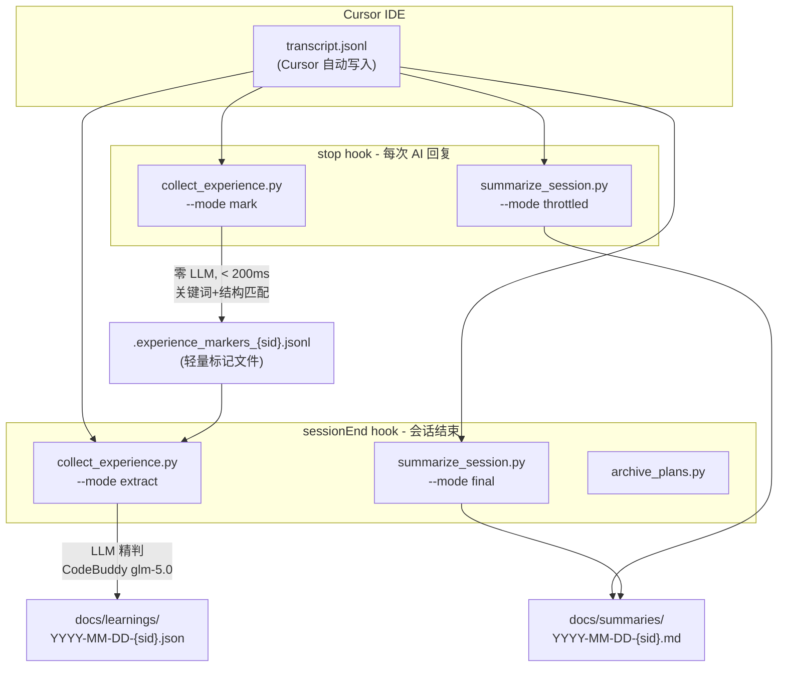

# 元学习第一层：经验采集实现规划

## 架构总览



## 一、新建脚本 `collect_experience.py`

位置: [`.cursor/hooks/collect_experience.py`](.cursor/hooks/collect_experience.py)

### 两种运行模式

**`--mode mark` (stop hook 调用)**
- 读取 transcript 最新 user 消息（最后 N 行）
- Stage 1 快速筛选：关键词匹配 + 对话结构信号
- 有信号 -> 追加 marker 到 `.experience_markers_{session_id}.jsonl`
- 无信号 -> 静默退出
- **零 LLM 调用、目标延迟 < 200ms**

**`--mode extract` (sessionEnd 调用)**
- 读取所有 markers
- 如果 markers < 2 条 -> 跳过（不值得 LLM 开销）
- 根据 marker 行号定位 transcript 上下文窗口（前后各 5 轮）
- Stage 2 LLM 精判：调用 CodeBuddy 生成结构化经验
- 去重（与已有条目 Jaccard 相似度 > 0.6 视为重复）
- 写入 `docs/learnings/YYYY-MM-DD-{session_id}.json`
- 清理 markers 文件

### L3 反馈信号消费（闭环入口）

`--mode mark` 和 `--mode extract` 启动时均读取 `docs/distilled/metrics/l1-hints.json`（如存在）：

- **heightened_categories**：对这些类别的 Stage 1 关键词匹配降低阈值（即更容易标记），增加检测灵敏度
- **suppressed_categories**：对这些类别提高阈值（降低灵敏度），减少低价值 marker 产出

实现方式：在 `EXPLICIT_PATTERNS` / `TOOL_FAILURE_PATTERNS` 匹配后，根据 hints 对命中结果做加权过滤。heightened 类别的 marker 无条件保留；suppressed 类别需至少命中 2 个关键词才标记。

如 `l1-hints.json` 不存在或解析失败，静默使用默认阈值（不影响正常运行）。

### Stage 1 快速筛选器

三类信号源：

```python
# a) 用户显式纠正
EXPLICIT_PATTERNS = [
    r"不对|不是|错了|不应该|别这样",
    r"应该[用是]|改[成为]|换成|不要用",
    r"为什么没|怎么又|之前说过|不是这个意思",
    r"再试|重新[做来]|还是不行",
]

# b) 对话结构信号
# - 用户连续两条消息（AI 回复被忽略/打断）
# - 用户极短消息紧接 AI 长回复（否定信号）

# c) 工具失败信号
TOOL_FAILURE_PATTERNS = [r"Error:|Exception:|failed|错误|失败"]
```

### Stage 2 LLM 提取 Prompt

核心指令：让 LLM 对每个候选片段输出 JSON，包含 `is_correction`, `confidence`, `type`, `trigger`, `observation`, `lesson`, `rule_candidate` 等字段。置信度 < 0.6 的丢弃。

## 二、经验记录数据模型（JSON）

文件路径: `docs/learnings/YYYY-MM-DD-{session_6char}.json`

```json
{
  "session_id": "c14b19",
  "date": "2026-03-14",
  "summary_ref": "docs/summaries/2026-03-14-c14b19.md",
  "session_topics": ["delegation", "coding"],
  "event_count": 3,

  "events": [
    {
      "id": "evt-20260314-c14b19-001",
      "timestamp": "2026-03-14T21:15:32",
      "type": "correction/user",
      "severity": "high",

      "trigger": "用户说：\"你不应该自己写代码，应该派给 implementer。\"",
      "observation": "中控在执行 Plan 时直接编写了 Python 代码，而非按 meta-agent-identity 规则将编码任务委派给 implementer。",
      "lesson": "执行涉及代码编写的 todo 时必须先输出调度表，将编码任务派给 implementer subagent。",

      "context": {
        "task": "实现 session summary hook 脚本",
        "what_ai_did": "直接开始编写 summarize_session.py",
        "what_should_have_done": "调度 implementer 编写",
        "conversation_window": {
          "before": "中控正在按 Plan 逐步执行",
          "trigger_turn": "用户指出应该委派 subagent",
          "after": "中控后续改为调度 implementer"
        }
      },

      "_distill_status": "pending",

      "distillation": {
        "rule_candidate": "编码任务必须委派给 implementer subagent",
        "target_file": ".cursor/rules/meta-agent-identity.mdc",
        "confidence": 0.95,
        "action": "reinforce"
      }
    }
  ]
}
```

字段说明：
- `session_topics`：本会话涉及的主题标签（由 L1 extract 阶段 LLM 生成），供 L3 规则评估计算暴露会话
- `_distill_status`：每个 event 的蒸馏状态，`"pending"` 由 L1 写入，`"distilled"` 由 L2 写回
- `distillation`：选填，L1 extract 阶段 LLM 输出的蒸馏线索，降低 L2 蒸馏开销

### 分类体系（两级分类法）

- `correction/user` - 用户显式纠正
- `correction/self` - AI 自我修正
- `failure/task` - 任务失败（verifier 阻断等）
- `failure/tool` - 工具调用失败
- `failure/process` - 流程失败（hook 未触发等）
- `preference/style` - 风格偏好
- `preference/workflow` - 工作流偏好
- `preference/tooling` - 工具偏好
- `violation/rule` - 违反 Rules
- `violation/skill` - 违反 Skills
- `violation/arch` - 违反架构约束
- `insight/pattern` - 发现可复用模式
- `insight/boundary` - 发现能力边界

## 三、Marker 文件格式

位置: `.cursor/hooks/.experience_markers_{session_id}.jsonl`（临时文件，extract 后清理）

每行一个 JSON：

```json
{"line": 1205, "type": "explicit_correction", "keywords": ["不应该"], "ts": "2026-03-14T21:15:32"}
```

## 四、节流策略

三层节流，与 [`summarize_session.py`](.cursor/hooks/summarize_session.py) 的现有常量对齐：

| 层 | 策略 | 参数 |
|----|------|------|
| L1 | 事件门槛 | 关键词命中才标记，非命中静默退出 |
| L2 | 去重 | 同 session 同类 marker 合并计数 |
| L3 | 会话级 | 每 session 最多 20 条 marker；extract 最少需 2 条 marker |

独立的 state 文件: `.cursor/hooks/.correction_state_{session_id}.json`

## 五、hooks.json 变更

```json
{
  "version": 1,
  "hooks": {
    "stop": [
      {"command": "py -3 .cursor/hooks/summarize_session.py --mode throttled"},
      {"command": "py -3 .cursor/hooks/collect_experience.py --mode mark"}
    ],
    "sessionEnd": [
      {"command": "py -3 .cursor/hooks/summarize_session.py --mode final"},
      {"command": "py -3 .cursor/hooks/collect_experience.py --mode extract"},
      {"command": "py -3 .cursor/hooks/archive_plans.py"}
    ]
  }
}
```

## 六、可复用基础设施

从 [`summarize_session.py`](.cursor/hooks/summarize_session.py) 直接复用的函数/模式（初期拷贝，后续提取 `_lib/`）：

- `read_stdin()` / `_resolve_session_id()` - stdin 和 session 解析
- `resolve_project_dir()` / `resolve_transcript_path()` - 路径解析
- `find_codebuddy_auth()` / `_parse_auth_file()` - CodeBuddy 认证
- `parse_sse_response()` - SSE 流式响应解析
- `_extract_content()` / `parse_transcript()` - transcript 解析
- `acquire_lock()` / `release_lock()` - 文件锁
- `watchdog_timer()` - 硬超时保护
- `setup_logging()` - 日志配置

## 七、冷启动

从已有的 2 个 session summaries 做一次性种子提取：
- `docs/summaries/2026-03-14-c14b19.md`
- `docs/summaries/2026-03-14-unknow.md`

用 LLM 从中提取纠正事件，标记为 `source: "seed_from_summary"`，置信度降一级（0.7）。可作为 `collect_experience.py --mode seed` 实现。

## 八、可靠性保障

完全复用 `summarize_session.py` 已验证的防御模式：
- Watchdog 硬超时（180s）
- 独立 `.lock` 文件（Windows msvcrt）
- 顶层 catch-all + `sys.exit(0)` 静默退出
- 原子写入（tmp + os.replace）
- Marker 文件使用 JSONL 追加模式（无需原子替换）

## 九、LLM 消耗预估

- 每次 extract: 3-8 个候选片段 x ~4000 token/片段 = ~15K-35K token
- API 调用次数: 3-8 次/session
- 预计耗时: 15-40 秒（串行）
- CodeBuddy 免费无限，完全够用

## 十、演进路径

1. **Phase 1（本次）**: 写 `collect_experience.py`，从 summarize 拷贝基础设施
2. **Phase 2**: 跑通后提取 `.cursor/hooks/_lib/` 共享库
3. **Phase 3**: 冷启动种子提取（`--mode seed`）
4. **Phase 4**: 下游消费 -> 知识蒸馏层（手动审阅 learnings -> 新增 Rules）
