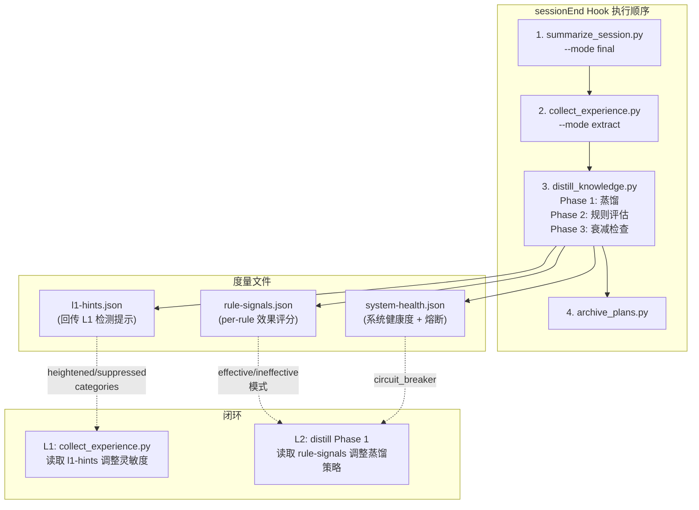
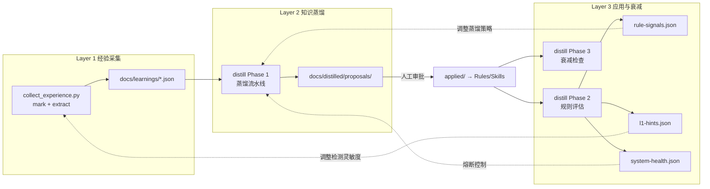

# 元学习第三层：知识应用、衰减与闭环反馈

## 一、知识注入机制

### 被动注入通道（Cursor 原生）

| 通道 | 内容 | 数量约束 |
|------|------|----------|
| **alwaysApply Rules** | T0 宪法 + T1 核心偏好 + 身份规则 | 硬性上限 **5 条** |
| **glob / contextual Rules** | T1 领域规则（如 Windows 兼容性） | 无硬限制，单条精简 |
| **Skills** | 反模式库、最佳实践 | 按需查阅 |
| **Agents** | Subagent 角色定义中内嵌知识 | 调度时注入 |

### 主动检索通道（中控执行）

中控在**输出调度表前**主动检索：
1. Read `antipatterns` Skill → 匹配当前任务相关的反模式
2. 在 Task prompt 中附加匹配到的知识，精准投递给 subagent

需在 [`meta-agent-identity.mdc`](.cursor/rules/meta-agent-identity.mdc) 的调度流程中增加"知识检索"步骤。

### 产物类型 → 注入通道映射

| L2 产物类型 | 写入位置 | 注入方式 |
|------------|----------|----------|
| `rule:create` | `.cursor/rules/{name}.mdc` 或合并入 Skill | 被动 (glob) 或 Skill |
| `rule:patch` | 修改已有 `.mdc` 内容 | 被动 |
| `rule:deprecate` | 从 rules/ 移除或标记废弃 | 被动（减少注入） |
| `preference:persist` | `meta-agent-identity.mdc` 偏好段落 | 被动 (alwaysApply) |
| `antipattern:create` | `.cursor/skills/antipatterns/SKILL.md` | Skill + 主动检索 |
| `skill:patch` | 修改已有 `SKILL.md` | 被动 (Skill) |
| `agent:patch` | 修改已有 `.cursor/agents/*.md` | 被动 (Agent) |

### 规则压缩

当同域规则 >= 3 条时，触发 LLM 合并为 1 条综合规则（如 3 条 Windows 文件操作规则 → 1 条 `windows-compat.mdc`）。合并后原始规则归档，综合规则继承最高 vitality。

## 二、闭环反馈机制

### 数据流总览



### 规则效果度量

每条已应用规则的效果通过 **Before/After 暴露加权频率** 衡量：

```
effectiveness = 1 - (corrections_after / exposed_sessions_after)
                  / (corrections_before / exposed_sessions_before)
```

**暴露会话** = 该规则目标类别被实际触及的会话（非所有会话）。需要 L1 经验数据增加 `session_topics` 字段。

**置信度更新**（简化贝叶斯）：
- 初始 0.5
- 暴露会话无纠正 → +0.05
- 暴露会话有纠正 → -0.10
- 至少 5 个暴露会话才做判定（约 1-2 周）

### 回传信号

**L3 → L1**：`docs/distilled/metrics/l1-hints.json`

```json
{
  "heightened_categories": [
    {"category": "code_style", "reason": "规则 X 标记 ineffective"}
  ],
  "suppressed_categories": [
    {"category": "skipped_process", "reason": "规则 Y 标记 effective"}
  ]
}
```

L1 `collect_experience.py` 读取此文件，对 heightened 类别降低 Stage 1 过滤阈值，对 suppressed 类别降低蒸馏优先级。

**L3 → L2**：`docs/distilled/metrics/rule-signals.json`

```json
{
  "rules": [
    {
      "rule_id": "...",
      "effectiveness_score": 0.78,
      "confidence": 0.65,
      "status": "evaluating",
      "narrative": "该规则使'跳过调度'类纠正从 75% 降至 17%"
    }
  ],
  "system_health": {
    "total_correction_rate_trend": "declining",
    "divergence_alert": false
  }
}
```

L2 蒸馏阶段读取此文件：effective 模式 → 提升类似经验蒸馏置信度；ineffective → 降低权重；counterproductive → 阻断自动蒸馏。

### 安全熔断

`docs/distilled/metrics/system-health.json` 维护熔断状态。触发条件（任一）：
- 规则数 > 30 且连续 3 周校正率上升
- 检测到规则矛盾（同类别出现相反方向纠正）
- 规则净增速度 > 5 条/周

熔断后：L2 蒸馏阶段读取 `circuit_breaker.active == true` → 跳过蒸馏。中控在会话中提醒用户。需用户明确确认才恢复。

## 三、衰减机制

### vitality 评分体系

| 参数 | 值 |
|------|---|
| 初始值 | T0: 100, T1: 100, T2: 80, T3: 60（按 confidence 微调 ±20） |
| 宽限期 | 30 天不衰减 |
| 正常衰减（31-90 天） | 每天 -0.5 |
| 加速衰减（90+ 天） | 每天 -1.0 |
| 被引用/遵守 | +10（上限 100） |
| 被违反后纠正回来 | +5 |
| 被用户主动覆盖 | -15 |
| 与新规则矛盾 | -10 |
| 被新规则显式替代 | 直接降到 20 |
| T0 规则 | **永不衰减** |

### 状态阈值

| vitality | 状态 | 动作 |
|----------|------|------|
| >= 60 | `active` | 正常 |
| 40-59 | `declining` | 写入周报提醒 |
| 20-39 | `review_needed` | 等待人工审查 |
| < 20 | `archived` | 自动归档到 `docs/distilled/archived/` |

### 归档流程

1. applied 记录标记 `status: "archived"`，记录归档原因
2. 对应的 `.mdc` 文件从 `.cursor/rules/` 移除
3. 归档文件移到 `docs/distilled/archived/`
4. 归档 180 天后无复活 → 移到 `docs/distilled/retired/`（永久退役，仍可追溯）

### 复活机制（v2）

- 蒸馏层发现新经验与归档规则高度相似 → 提议复活
- 复活后 vitality = 60（需重新证明价值）

## 四、distill_knowledge.py 三阶段结构

```
distill_knowledge.py --mode incremental
  │
  ├── Phase 1: 蒸馏（已在 L2 规划中定义）
  │   摄入 → 分流 → LLM蒸馏 → 冲突检测 → 质量评估 → 输出候选
  │   读取 rule-signals.json 调整蒸馏策略
  │   读取 system-health.json 检查熔断
  │
  ├── Phase 2: 规则评估（本层新增）
  │   读取最近会话的 L1 经验数据
  │   读取 applied/ 下所有活跃规则
  │   对每条规则计算暴露/校正/遵从
  │   更新 rule-signals.json
  │   更新 l1-hints.json
  │   检测系统发散 → 更新 system-health.json
  │
  └── Phase 3: 衰减检查（本层新增）
      遍历 applied/*.json
      计算时间衰减（零 LLM）
      更新 vitality
      vitality < 20 → 自动归档
      生成衰减报告
```

**`--mode report`**：手动触发，生成周报到 `docs/distilled/reports/YYYY-WNN.md`。

## 五、新增文件结构

```
docs/distilled/
├── proposals/            # (L2) T3 待审批候选
├── applied/              # (L2) 已生效规则记录
├── rejected/             # (L2) 被拒绝记录
├── archived/             # (L3) 归档的衰减规则
├── retired/              # (L3) 永久退役规则
└── metrics/              # (L3) 反馈信号
    ├── rule-signals.json
    ├── l1-hints.json
    └── system-health.json

.cursor/skills/
└── antipatterns/         # (L3) 反模式 Skill（新建）
    └── SKILL.md
```

## 六、新增/修改的 Cursor Rules

1. **修改 `meta-agent-identity.mdc`**：调度流程增加"知识检索"步骤（派单前查阅 antipatterns Skill）
2. **新建 `distill-review.mdc`**（L2 已规划）：增加会话开始时检查 metrics 异常并提醒

## 七、度量指标（v1 北极星 + 基础指标）

| 指标 | 含义 | 采集方式 |
|------|------|----------|
| **纠正频率趋势**（北极星） | 各类别校正率是否下降 | Phase 2 自动统计 |
| per-rule effectiveness | 每条规则的效果评分 | Phase 2 Before/After |
| rule_adoption_rate | 规则遵从签名出现率 | Phase 2 transcript 搜索 |
| rule_library_size | 活跃规则数 + 周新增/退役 | Phase 3 统计 |
| divergence_alert | 系统是否在发散 | Phase 2 检测 |

## 八、"记忆即身份"的调和

```
永久记忆层（只增不删）            可衰减层（活跃→归档→退役）
┌─────────────────────┐     ┌─────────────────────┐
│ docs/learnings/      │     │ .cursor/rules/       │
│ docs/summaries/      │     │ distilled/applied/   │
│                      │     │                      │
│ "我经历了什么"       │     │ "我现在怎么做"       │
│ = 身份的历史叙事     │     │ = 身份的操作手册     │
└─────────────────────┘     └─────────────────────┘

归档 ≠ 遗忘。归档 = "不再主动使用，但可追溯、可复活"。
```

## 九、hooks.json 最终形态

```json
{
  "version": 1,
  "hooks": {
    "stop": [
      {"command": "py -3 .cursor/hooks/summarize_session.py --mode throttled"},
      {"command": "py -3 .cursor/hooks/collect_experience.py --mode mark"}
    ],
    "sessionEnd": [
      {"command": "py -3 .cursor/hooks/summarize_session.py --mode final"},
      {"command": "py -3 .cursor/hooks/collect_experience.py --mode extract"},
      {"command": "py -3 .cursor/hooks/distill_knowledge.py --mode incremental"},
      {"command": "py -3 .cursor/hooks/archive_plans.py"}
    ]
  }
}
```

执行顺序保证：summarize → L1 extract → L2+L3 distill → archive。

## 十、三层架构完整闭环


