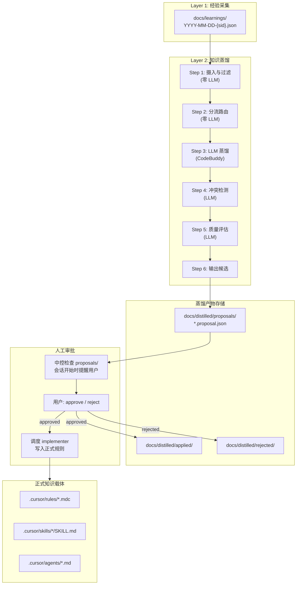
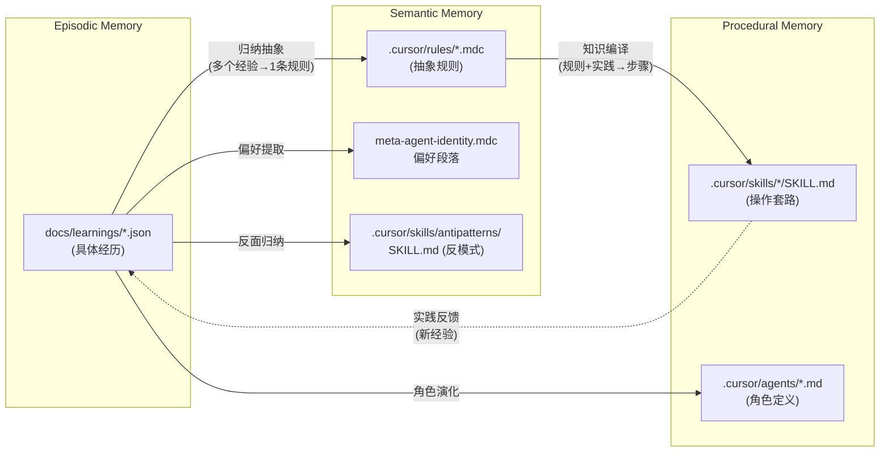

# 元学习第二层：知识蒸馏实现规划

## 格式修订

**L1 格式变更**：第一层经验采集的输出格式从 YAML 改为 JSON（`json.dumps(indent=2)`），文件后缀改为 `.json`。

- `docs/learnings/YYYY-MM-DD-{session}.yaml` -> `docs/learnings/YYYY-MM-DD-{session}.json`
- marker 文件已经是 JSONL，无变化

这保持了零依赖约束，同时 JSON 的 `indent=2` 格式保证了人类可读性。

---

## 一、架构总览




## 二、蒸馏产物的 7 种类型


| 代号                   | 说明                   | 目标载体                                   | 备注                 |
| -------------------- | -------------------- | -------------------------------------- | ------------------ |
| `rule:create`        | 从重复经验中提取新行为规范        | `.cursor/rules/*.mdc`                  | 最常见                |
| `rule:patch`         | 对已有规则的强化/收窄/补充       | 已有 `.mdc` 文件                           |                    |
| `rule:deprecate`     | 标记过时规则               | 已有 `.mdc` frontmatter                  |                    |
| `preference:persist` | 稳定的用户偏好持久化           | `meta-agent-identity.mdc` 偏好段落         | 被动注入 (alwaysApply) |
| `antipattern:create` | "不该做什么"的显式记录         | `.cursor/skills/antipatterns/SKILL.md` | Skill + 主动检索       |
| `skill:patch`        | 新增步骤/约束到已有 Skill     | `.cursor/skills/*/SKILL.md`            |                    |
| `agent:patch`        | 修改 Agent 的 prompt/流程 | `.cursor/agents/*.md`                  |                    |


## 三、四级信任层级


| 等级         | 名称          | 来源                           | 修改权限          |
| ---------- | ----------- | ---------------------------- | ------------- |
| **T0: 宪法** | 人工制定的架构根基   | `ARCHITECTURE.md`, 五大第一性原理   | 仅人工，蒸馏不可碰     |
| **T1: 法律** | 人工审批通过的正式规则 | `.cursor/rules/*.mdc` 中的已有规则 | 蒸馏提议 + 人工批准   |
| **T2: 试用** | 通过观察期的蒸馏规则  | 标记 `provisional: true`       | v1 不实现，v2 再开放 |
| **T3: 建议** | 蒸馏新提取的候选    | `docs/distilled/proposals/`  | 等待人工审批        |


**v1 策略**：所有蒸馏产物都从 T3 开始，必须经人工审批才能升为 T1 应用到正式文件。T2 试用层在 v1 不实现。

## 四、Proposal 文件格式

文件路径: `docs/distilled/proposals/{id}.proposal.json`

```json
{
  "id": "dist-20260314-001",
  "created": "2026-03-14T23:45:00",
  "type": "rule:create",
  "tier": "T3",
  "status": "pending_review",

  "source_experiences": [
    "docs/learnings/2026-03-14-c14b19.json#evt-001",
    "docs/learnings/2026-03-15-a3f2b1.json#evt-003"
  ],
  "pattern_count": 3,
  "confidence": 0.82,

  "target": {
    "file": ".cursor/rules/no-direct-coding.mdc",
    "action": "create"
  },

  "content": "---\ndescription: ...\nalwaysApply: true\n---\n\n# ...",

  "rationale": "在 3 次独立会话中观察到中控跳过调度直接编码...",

  "conflict_check": {
    "has_conflict": false,
    "conflicting_rule": null
  },
  "quality_score": 0.85,

  "review": {
    "reviewed_by": null,
    "reviewed_at": null,
    "decision": null,
    "reason": null
  }
}
```

## 五、蒸馏流水线（6 步）

### Step 1: 摄入与过滤（零 LLM）

- 读取所有未蒸馏经验（`_distill_status != "distilled"`）
- 过滤 confidence < 0.6 的条目

### Step 2: 分流路由（零 LLM）

- 高置信度（>= 0.9）→ 单条蒸馏路径
- 中置信度（0.6~0.9）→ 按 `(target_file, type)` 预分组，组内 >= 3 条才蒸馏

### Step 3: LLM 蒸馏（1 次 LLM / 条或组）

- 单条蒸馏：经验 + 目标文件已有内容 -> LLM 生成规则草案
- 聚合蒸馏：一组经验 + 目标文件已有内容 -> LLM 提取共性规则
- 输出严格 JSON：`rule_text`, `rationale`, `scope`, `anti_pattern`, `quality_score`

### Step 4: 冲突检测（1 次 LLM / 候选）

- 新规则 vs 目标文件已有规则集
- 输出：`has_conflict`, `conflict_type`, `resolution`, `can_auto_resolve`
- 有不可自动解决的冲突 -> 标记 `status: conflict_detected`

### Step 5: 质量评估（1 次 LLM / 候选）

- 5 维度评分：specificity, actionability, verifiability, necessity, consistency
- overall < 0.7 -> LLM 同时输出改进版本（省一次调用）
- overall >= 0.6 才进入候选区

### Step 6: 输出候选（零 LLM）

- 写入 `docs/distilled/proposals/`
- 更新经验的 `_distill_status` 为 `"distilled"`
- 更新 state 文件

## 六、实现：`distill_knowledge.py`

位置: `[.cursor/hooks/distill_knowledge.py](.cursor/hooks/distill_knowledge.py)`

### 两种运行模式


| 模式                   | 触发方式                             | 处理范围                | 典型场景   |
| -------------------- | -------------------------------- | ------------------- | ------ |
| `--mode incremental` | sessionEnd hook（在 L1 collect 之后） | 仅本次会话新增经验           | 日常自动运行 |
| `--mode full`        | 手动执行                             | 全部未蒸馏 + 已蒸馏经验（重新聚合） | 周期性维护  |


### 与 L1 的时序协调

sessionEnd hook 中，`distill_knowledge.py` 排在 `collect_experience.py` 之后。脚本内置延迟等待：检查 learnings 文件的 mtime，等待 L1 输出稳定后再开始（最多等 15s）。

### hooks.json 变更

```json
{
  "version": 1,
  "hooks": {
    "stop": [
      {"command": "py -3 .cursor/hooks/summarize_session.py --mode throttled"},
      {"command": "py -3 .cursor/hooks/collect_experience.py --mode mark"}
    ],
    "sessionEnd": [
      {"command": "py -3 .cursor/hooks/summarize_session.py --mode final"},
      {"command": "py -3 .cursor/hooks/collect_experience.py --mode extract"},
      {"command": "py -3 .cursor/hooks/distill_knowledge.py --mode incremental"},
      {"command": "py -3 .cursor/hooks/archive_plans.py"}
    ]
  }
}
```

### 可复用基础设施

初期从 `summarize_session.py` 拷贝以下函数：

- LLM 调用链（CodeBuddy auth + SSE 解析 + Ollama fallback）
- 文件锁（msvcrt）
- Watchdog 硬超时
- stdin/session_id/path 解析

中期提取 `_lib/` 共享模块（当 3 个脚本的共享代码 > 50%）。

### LLM 消耗估算（Phase 1 蒸馏 + Phase 2 评估 + Phase 3 衰减）


| 场景         | Phase 1 蒸馏            | Phase 2 评估          | Phase 3 衰减  | 总计       |
| ---------- | --------------------- | ------------------- | ----------- | -------- |
| 增量：1 条高置信度 | 3 次 LLM (~20-45s)     | 0-1 次 LLM (~5-10s)  | 零 LLM (~1s) | ~25-56s  |
| 增量：3 条中置信度 | 4 次 LLM (~30-60s)     | 1-2 次 LLM (~10-20s) | 零 LLM (~1s) | ~41-81s  |
| 全量：20 条经验  | 8-12 次 LLM (~60-120s) | 2-4 次 LLM (~15-30s) | 零 LLM (~2s) | ~77-152s |


Phase 2 说明：规则评估需读取 L1 经验数据和 applied/ 规则，计算 Before/After 效果。大部分是纯计算（零 LLM），仅在需要分析纠正与规则的语义关联时调用 LLM。
Phase 3 说明：衰减检查为纯数学运算（vitality 计算 + 时间衰减），零 LLM 调用。

在 SCRIPT_HARD_TIMEOUT = 180s 内可完成。CodeBuddy 免费无限。最坏情况（全量）接近上限，建议全量模式单独的 HARD_TIMEOUT 提升到 300s。

## 七、人工审批流程

### "审批即对话"

1. `distill_knowledge.py` 生成 proposal 文件到 `docs/distilled/proposals/`
2. 需要一条新 Cursor Rule（如 `distill-review.mdc`）指示中控在会话开始时检查 proposals 目录
3. 有待审批项时，中控在首次回复中展示摘要：

```
发现 2 条蒸馏规则候选待审批：

1. [dist-20260314-001] rule:create 禁止中控直接编码
   来源: 3 条经验 | 置信度: 0.82 | 质量: 0.85
   
2. [dist-20260314-002] preference:persist 并行执行偏好
   来源: 2 条经验 | 置信度: 0.91 | 质量: 0.88

输入 approve 1 / reject 2 原因 / details 1 / defer
```

1. 用户审批后，中控调度 implementer 将规则写入正式文件
2. proposal 文件移动到 `applied/` 或 `rejected/`

## 八、基础度量体系（v1）

### 度量文件

位置: `docs/distilled/metrics/metrics.json`

```json
{
  "last_updated": "2026-03-14T23:00:00",
  "correction_frequency": {
    "current_week": 8,
    "previous_week": 12,
    "trend": "improving"
  },
  "rule_stats": {
    "total_active": 42,
    "by_origin": {"human": 35, "distilled": 7},
    "proposals_pending": 2,
    "proposals_approved": 5,
    "proposals_rejected": 1
  },
  "distillation_stats": {
    "total_experiences": 28,
    "total_distilled": 15,
    "rejection_rate": 0.14
  }
}
```

### 周报生成

位置: `docs/distilled/reports/YYYY-WNN.md`

由 `distill_knowledge.py --mode report` 手动触发，或在 `--mode full` 时附带生成。内容：

- 纠正事件频率趋势（北极星指标）
- 同类纠正重复率
- 规则库统计
- 待审批队列

### 会话提醒

仅在异常时提醒（如纠正频率上升 > 25%），正常情况不打扰用户。通过 `distill-review.mdc` Rule 实现。

## 九、衰减机制（v1 基础版）

每条已应用规则在 `docs/distilled/applied/` 的记录中维护：

```json
{
  "vitality": 80,
  "last_referenced": "2026-03-14",
  "times_referenced": 12,
  "times_violated_then_corrected": 2,
  "contradiction_count": 0
}
```

v1 的衰减只做**标记和提醒**，不自动淘汰：

- `vitality < 20` -> 下次会话提醒用户审查
- 衰减速率: T1 规则每天 -0.5（未被引用时），被引用一次 +10

## 十、目录结构总览

```
docs/
├── learnings/                        # L1 输出（JSON 格式）
│   └── YYYY-MM-DD-{sid}.json         # 按会话聚合的经验记录
├── distilled/                        # L2/L3 输出
│   ├── proposals/                    # T3 待审批候选
│   │   └── {id}.proposal.json
│   ├── applied/                      # 已应用记录（审计轨迹）
│   │   └── {id}.applied.json
│   ├── rejected/                     # 被拒绝记录
│   │   └── {id}.rejected.json
│   ├── archived/                     # L3 归档的衰减规则
│   ├── retired/                      # L3 永久退役规则
│   ├── metrics/                      # 反馈信号 + 聚合度量
│   │   ├── metrics.json              # 聚合统计（纠正频率、规则库统计等）
│   │   ├── rule-signals.json         # per-rule 效果评分
│   │   ├── l1-hints.json             # 回传 L1 检测提示
│   │   └── system-health.json        # 系统健康度 + 熔断状态
│   └── reports/                      # 周报
│       └── YYYY-WNN.md
├── summaries/                        # 已有：宏观会话摘要
└── plans/                            # 已有：归档的 plan 文件
```

## 十一、新增 Cursor Rule

新建 `[.cursor/rules/distill-review.mdc](.cursor/rules/distill-review.mdc)`：

- `alwaysApply: true`
- 指示中控在会话开始时检查 `docs/distilled/proposals/` 是否有 `pending_review` 状态的文件
- 有则展示审批摘要，支持 approve / reject / details / defer 指令
- 检查 `docs/distilled/metrics/metrics.json` 中的异常指标，有则提醒

## 十二、与三层记忆的映射




## 十三、演进路径


| 阶段         | 内容                              | 自动化程度            |
| ---------- | ------------------------------- | ---------------- |
| **v1（本次）** | 蒸馏流水线 + 全人工审批 + 基础度量            | 蒸馏自动，审批手动        |
| **v2**     | T2 试用层 + reinforce 半自动 + 衰减自动淘汰 | 低风险自动，高风险手动      |
| **v3**     | 偏好漂移检测 + 知识快照 + 蒸馏 prompt 自优化   | 大部分自动，仅 T0 相关需人工 |


