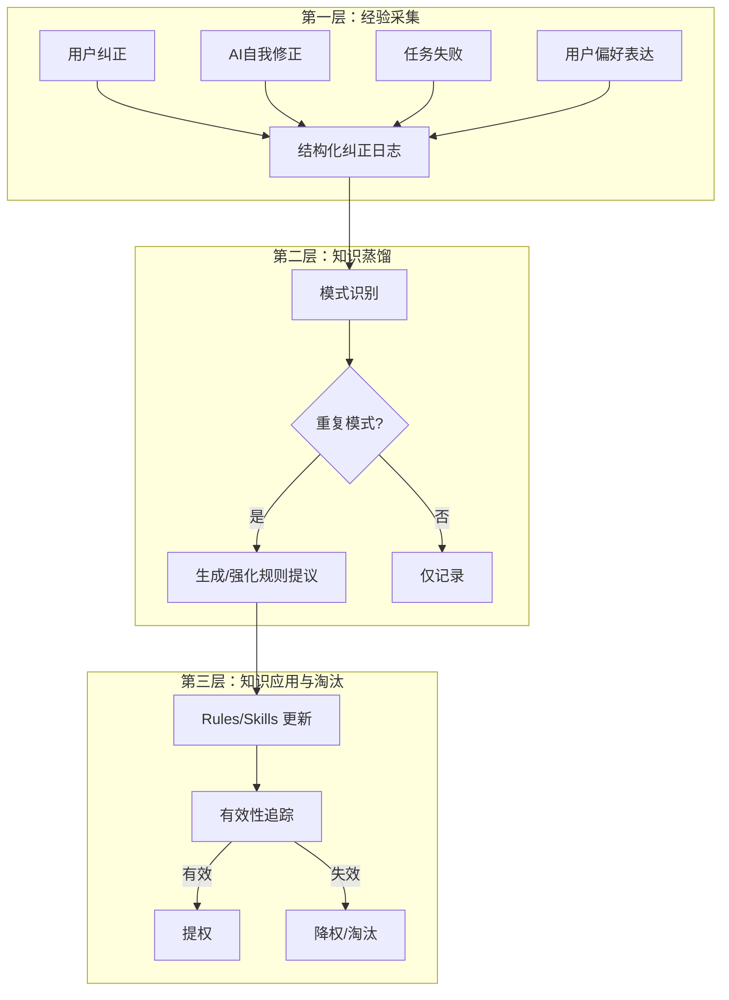

# 元学习：MetaAgent 的纵向自举引擎

## 定位

元学习不是一个功能特性，是 MetaAgent 的**第六条第一性原理**的候选项。

当前五条第一性原理覆盖了"怎么协作"（自然语言即协议、文件即交付物、黑盒封装）和"怎么扩展"（自举能力、记忆即身份）。但缺少"怎么变强" — 系统如何从运行经验中改进自身。

**横向自举** = Blueprint DNA 生成新 Agent（扩展能力边界）
**纵向自举** = 元学习引擎进化已有规则（提升能力质量）

两者共同构成完整的自举能力。

## 核心问题

> 当前体系的改进循环完全依赖人类驱动：用户发现问题 → 分析根因 → 手动修改规则。
> 目标：让系统能**自动发现模式性问题、提取可复用教训、进化自身规则**。

## 三层架构




### 第一层：经验采集（Observation）

**现有基础：** session summaries 提供粗粒度经验记录。

**缺失：** 结构化的纠正事件记录。需要捕获：

- 触发场景（当时在做什么）
- 用户纠正内容（用户说了什么）
- AI 原始行为（AI 做了什么/没做什么）
- 修正动作（改了什么规则/代码）
- 事件分类（流程违反 / 质量问题 / 偏好偏差 / 知识缺口）

**载体：** `docs/learnings/` 目录，每个会话的经验记录聚合为一个结构化 JSON 文件（`YYYY-MM-DD-{session}.json`），符合"文件即交付物"原则。（早期设计为 `docs/corrections/` + Markdown，后在 L1 详细规划中演进为当前方案）

**采集时机：**

- 用户显式纠正时（如"为什么没用 subagent"）
- verifier 发现阻断问题时
- 同类错误第二次出现时

### 第二层：知识蒸馏（Distillation）

**核心机制：** 从纠正日志中识别重复模式，提取可复用的策略原则。

**参考论文：**

- **EvolveR**（2025）：离线自蒸馏，将交互轨迹合成为"战略原则"
- **MetaEvo**（2025）：元优化阶段，训练模型抽象高质量原则
- **ACE / 微软**（2025）：生成 → 反思 → 策展循环，防止 context collapse
- **ScRPO**（2025）：从错误中学习，分析并矫正推理缺陷

**MetaAgent 适配方案（待设计）：**

- 选项 A：在 sessionEnd hook 中用 LLM 分析纠正日志，自动生成规则提议
- 选项 B：独立的"反思 Agent"（新 Subagent），定期审视纠正日志
- 选项 C：在 session summary 中增加"本次纠正 → 规则提议"段落

### 第三层：知识应用与淘汰（Retrieval + Decay）

**应用：** 已有机制（Rules alwaysApply、Skills 按需激活）可复用。

**淘汰（缺失）：** 需要新机制：

- 每条规则附带元数据：创建时间、最后引用时间、引用次数、来源（手动/自动）
- 长期未引用的规则标记为候选淘汰
- 被新规则取代的旧规则自动归档
- 参考 MemRL 论文的"两阶段检索 + 权重衰减"

## 与现有架构的关系

**对 ARCHITECTURE.md 第一性原理的潜在扩展：**

当前第五条"记忆即身份"可扩展为：


| 原则       | 含义                               |
| -------- | -------------------------------- |
| 记忆与学习即身份 | 长期记忆的累积**和从记忆中提取的教训**共同构成"我"的独特性 |


或新增第六条：


| 原则    | 含义                         |
| ----- | -------------------------- |
| 纠正即进化 | 每一次纠正都是系统变强的机会，必须被捕获、蒸馏、应用 |


**反思的两个层次（边界定义）：**


| 层次            | 机制                                                     | 载体           | 范围             | 触发             |
| ------------- | ------------------------------------------------------ | ------------ | -------------- | -------------- |
| **Agent 级反思** | Blueprint DNA `reflection/` 模块（reward.py + reflect.py） | SQLite + LLM | 单 Agent 域内自学习  | Agent 任务结束后    |
| **系统级元学习**    | 三层架构（L1 采集 → L2 蒸馏 → L3 应用/衰减）                         | 文件系统 + LLM   | 跨 Agent / 中控层面 | Cursor hook 触发 |


两者独立运行，互不干预。系统级元学习不修改 Agent 内部 reflection 数据，Agent 级反思不写入 `docs/learnings/`。未来如需打通（如将 Agent 反思产出汇入系统级经验池），应作为 Phase 2+ 扩展点设计。

**对现有模块的影响：**

- **Unified Memory**（ARCHITECTURE.md 第三节）：增加"教训记忆"层（lessons learned），与现有 semantic memory、task chain memory 并列
- **Bootstrap Engine**：增加"纵向自举"路径（规则进化），与现有"横向自举"（Agent 生成）并列
- **Identity Core**：身份不再只是静态配置，而是包含进化历史的动态实体

## 今天的实证案例

```
时间线：
1. 用户发现 AI 未调度 Subagent（经验采集 - 用户纠正）
2. 分析根因：规则存在但 AI 不遵守（知识蒸馏 - 模式识别）
3. 设计"执行前检查点"写入规则（知识蒸馏 - 生成规则）
4. 发现仍可能被绕过，引入"反说服防线"（知识蒸馏 - 迭代强化）
5. 下次执行时按调度表行事（知识应用）
```

这个循环完全是手动的。元学习引擎的目标是将步骤 1-4 自动化。

## 开放问题（待后续讨论）

1. **蒸馏的粒度**：什么级别的纠正值得生成规则？单次偏差 vs 重复模式？阈值是什么？
2. **自动 vs 人工审批**：自动生成的规则是否需要用户确认才能生效？还是先生效后淘汰？
3. **规则冲突**：自动生成的规则与手动规则冲突时如何仲裁？
4. **冷启动**：新项目/新 Agent 如何继承已有项目的教训？跨项目知识迁移？
5. **过拟合风险**：从少量纠正中提取的规则是否过于特化？如何泛化？
6. **度量**：如何衡量"系统变强了"？需要什么指标？

