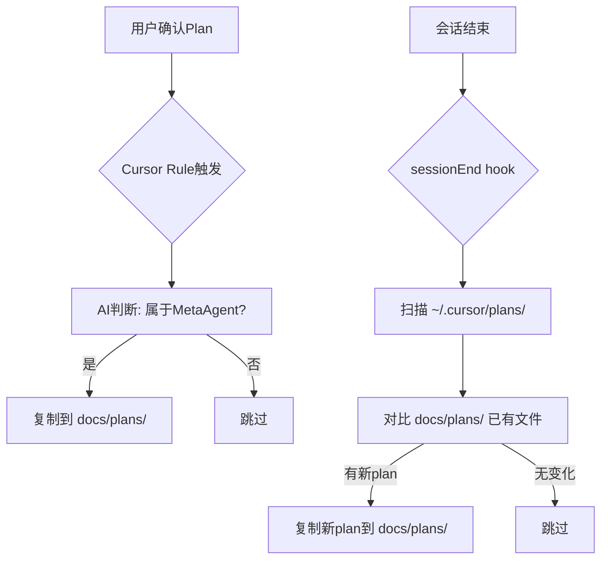

# Plan 自动归档机制

## 问题

Cursor 的 plan 文件存储在全局目录 `~/.cursor/plans/`，混合了多个项目的 plan。MetaAgent 项目需要将属于自己的 plan 归档到 `docs/plans/`，但目前没有自动化机制。

## 设计方案：Cursor Rule 驱动 + sessionEnd 兜底

核心思路：plan 归档的最佳时机是"用户确认 plan 后、开始执行前"——这个时机只有 Cursor 自身知道。因此用 **Cursor Rule** 作为主力触发，**sessionEnd hook** 作为兜底。

### 第一层：Cursor Rule（主力）

新建 `[.cursor/rules/plan-archiving.mdc](.cursor/rules/plan-archiving.mdc)`，`alwaysApply: true`。

规则内容指示 Cursor：

- 每当用户确认 plan 后、开始执行 todo 之前，判断该 plan 是否属于 MetaAgent 项目
- 判断依据：plan 内容是否涉及 MetaAgent 的文件路径、架构概念、或在 MetaAgent workspace 中创建
- 如果属于本项目，将 plan 从 `~/.cursor/plans/` 复制到 `docs/plans/<kebab-name>.plan.md`
- 命名规则：取 YAML frontmatter 的 `name` 字段，转 kebab-case，如 `CodeBuddy Proxy for Cursor` -> `codebuddy-proxy-for-cursor.plan.md`

**优势**：时机精准（确认后、执行前），AI 有完整上下文判断归属，零额外代码。

### 第二层：sessionEnd hook 兜底（脚本）

在现有 `summarize_session.py` 的 `--mode final` 路径中加入 plan 归档检查，或新建独立脚本 `.cursor/hooks/archive_plans.py`。

逻辑：

1. 扫描 `~/.cursor/plans/*.plan.md`
2. 对每个文件，用文件名 hash 后缀或内容 hash 对比 `docs/plans/` 已有文件
3. 新文件或已修改的文件 -> 复制到 `docs/plans/`
4. 归属判断：简单启发式 — 检查 plan 内容是否包含 MetaAgent 特征关键词（如 `MetaAgent`、`docs/ARCHITECTURE.md`、`.cursor/hooks/`、`CURSOR_TRANSCRIPT_PATH` 等）

**优势**：不依赖 AI 判断，纯规则驱动，作为安全网捕获遗漏。

### 实现范围

**需要新建/修改的文件：**

- 新建 `.cursor/rules/plan-archiving.mdc` — Cursor Rule，约 30 行
- 新建 `.cursor/hooks/archive_plans.py` — 兜底脚本，约 80 行
- 修改 `.cursor/hooks.json` — 在 sessionEnd 中追加 archive_plans 命令

**归档命名规范：**

- 格式：`<kebab-name>.plan.md`
- 来源：YAML frontmatter 的 `name` 字段
- 示例：`Cursor Subagent Design` -> `cursor-subagent-design.plan.md`

**不做的事：**

- 不自动删除 `~/.cursor/plans/` 中的源文件（Cursor 可能还在读取）
- 不处理其他项目的 plan 归档（各项目各自负责）
- 不依赖 LLM 做归属判断（兜底脚本用关键词匹配即可）

