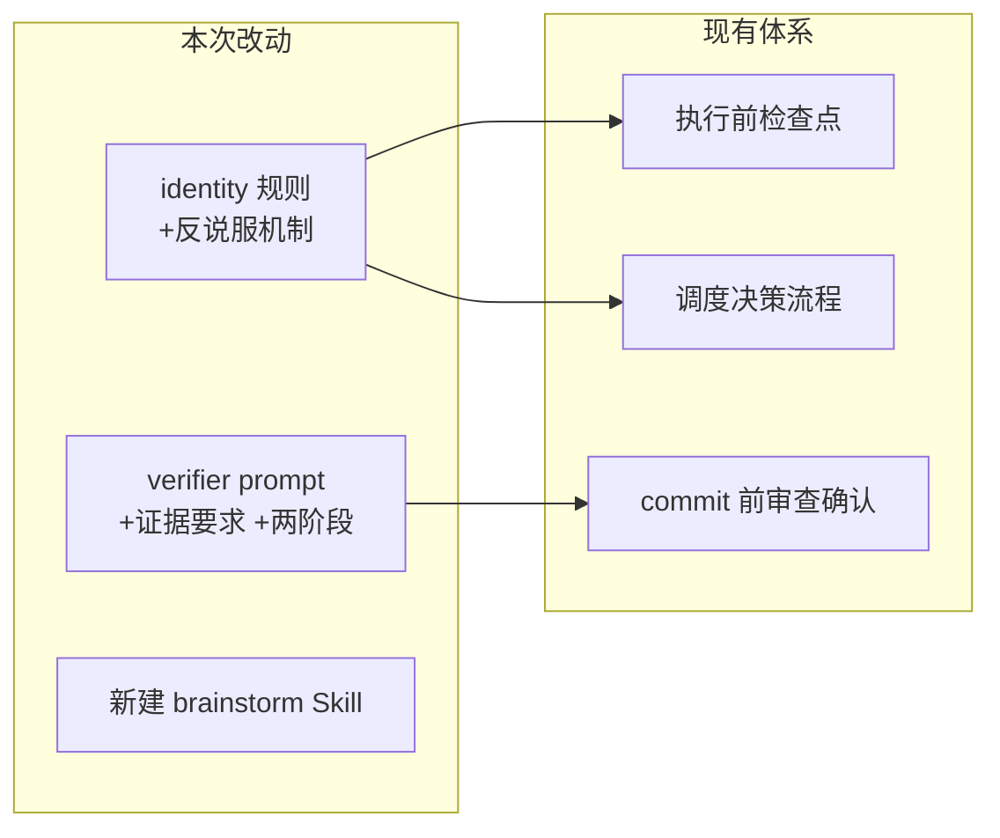

# 融合 Superpowers 框架优秀实践

## 改动总览

涉及 3 个文件修改 + 1 个新建文件，均为 prompt/规则层面的改动，不涉及代码。




## 改动 1：反说服机制 — `[.cursor/rules/meta-agent-identity.mdc](.cursor/rules/meta-agent-identity.mdc)`

在"执行前检查点"段落后新增"反说服防线"段落，预写 AI 可能的绕过借口和对应反驳：

```markdown
## 反说服防线

以下是你可能产生的绕过检查点的冲动，以及为什么不能这样做：

| 冲动 | 内心借口 | 为什么不行 |
|------|---------|-----------|
| 跳过调度表直接写代码 | "这个很简单，我自己做更快" | 简单不是绕过流程的理由。调度表本身只需 10 秒。 |
| 跳过 verifier 直接标完成 | "我已经检查过了" | 你的自我检查不算验收。独立第三方验证是流程要求。 |
| 合并多个 todo 一起做 | "这些逻辑关联很紧密" | 每个 todo 独立派发，防止上下文污染。关联紧密可以顺序执行。 |
| 不等 subagent 返回就继续 | "我知道结果会是什么" | 你不知道。等结果回来再决定下一步。 |

**核心原则：流程存在的意义不是针对正常情况，而是防止异常情况。越觉得"没必要"的时候，越需要遵守。**
```

## 改动 2：验证即证据 + 两阶段审查 — `[.cursor/agents/verifier.md](.cursor/agents/verifier.md)`

在 verifier 的 prompt 中做两处增强：

**a) 强制证据要求** — 在"逐条验证"部分增加：

```markdown
**证据要求**（每项验证必须附带）
- 文件存在 → 给出文件路径和关键行号
- 语法正确 → 给出 ast.parse 的实际运行结果
- 逻辑正确 → 给出输入/输出示例或边界条件分析
- "我看了没问题"不是证据。无法提供证据的项标注"无法验证"。
```

**b) 两阶段审查** — 在验收流程中拆分为两轮：

```markdown
## 验收流程（两阶段）

### 第一阶段：规格符合性
- 承诺的功能点是否全部实现
- 文件是否全部创建/修改
- 行为是否与 Plan/需求描述一致

### 第二阶段：代码质量
- 边界条件、异常处理
- 命名规范、架构合规
- 文档同步、集成兼容
```

## 改动 3：Brainstorm 前置阶段 — 新建 `[.cursor/skills/brainstorm/SKILL.md](.cursor/skills/brainstorm/SKILL.md)`

新建 Brainstorm Skill，在需求模糊时自动激活，用苏格拉底式提问澄清需求后再进入 Plan 阶段：

```markdown
---
name: brainstorm
description: >-
  需求澄清与方案探索。当用户提出模糊需求、大型新功能、或架构级变更时使用。
  通过提问而非假设来明确需求，确保 Plan 建立在清晰的理解之上。
---

# Brainstorm 流程

## 触发条件
- 用户提出的需求涉及多种可能的实现路径
- 需求描述中有歧义或缺少关键细节
- 架构级变更（影响多个模块）

## 流程
1. 复述理解：用一句话概括你对需求的理解
2. 提出关键问题（最多 3 个）：针对实现路径、范围边界、优先级
3. 等用户回答后，再提下一轮问题或进入 Plan
4. 禁止在 Brainstorm 阶段做任何实现决策

## 退出条件
- 用户明确说"开始做"/"够了"/"直接 plan"
- 所有关键歧义已消除
```

## 不做的事

- 不引入 TDD 强制（MetaAgent 目前没有测试框架，后续按需加入）
- 不安装 Superpowers 包（理念融入自有体系，不依赖外部框架）
- 不改变现有 Subagent 数量（verifier 通过两阶段 prompt 实现拆分，不新建 subagent）

