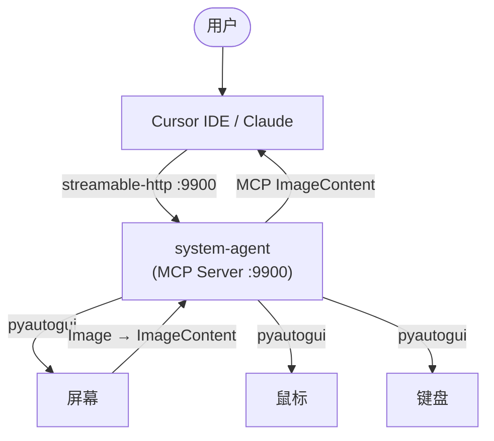

# System Agent：AI 的"身体"

## 一、第一性原理

人类操作电脑的全部交互通道：

```
感知：眼睛 → 看屏幕
行动：手握鼠标 → 移动、点击、拖拽、滚动
行动：手按键盘 → 打字、组合键
```

Agent 的最小完备操作集 = 模拟这三个通道。

## 二、7 个原生操作


| 工具               | 人类行为   | 参数                                               | 返回                            |
| ---------------- | ------ | ------------------------------------------------ | ----------------------------- |
| `screenshot`     | 看屏幕    | `region_x?, region_y?, region_w?, region_h?`     | MCP ImageContent（Claude 直接可见） |
| `mouse_move`     | 移动鼠标   | `x, y`                                           | ok                            |
| `mouse_click`    | 点击     | `x, y, button?="left", clicks?=1`                | ok                            |
| `mouse_drag`     | 拖拽     | `start_x, start_y, end_x, end_y, button?="left"` | ok                            |
| `keyboard_type`  | 打字     | `text`                                           | ok                            |
| `keyboard_press` | 按键/组合键 | `keys`（如 `"enter"`, `"ctrl+s"`, `"alt+tab"`）     | ok                            |
| `scroll`         | 滚动鼠标滚轮 | `x, y, clicks`                                   | ok                            |


**7 个函数 = 人类与电脑全部交互的完备集。**

拖拽（`mouse_drag`）是独立原语——`mouse_click`（按下即松开）+ `mouse_move`（不持有按键）无法组合出拖拽。窗口缩放、文件拖放、滑块控制、Houdini 节点连线都依赖拖拽。

## 三、工作循环

```
用户: "帮我启动 Houdini MCP"

Claude 循环:
  ① screenshot()       → 看到桌面
  ② 分析截图            → "需要双击 Houdini 图标"
  ③ mouse_click(x, y, clicks=2)
  ④ screenshot()       → 验证 Houdini 已启动
```

每一步：**看 → 想 → 做 → 看（验证）**。

## 四、架构




system-agent 只是一层薄桥：Claude 意图 → pyautogui 调用，屏幕截图 → MCP ImageContent。

## 五、技术实现

### 5.1 核心代码

```python
from __future__ import annotations

import json
import logging
import time
from pathlib import Path

from fastmcp import FastMCP
from fastmcp.utilities.types import Image
import pyautogui
import pyperclip

log = logging.getLogger("system-agent")

# --- 配置 ---
_CFG_PATH = Path(__file__).parent / "system-agent.json"
_cfg: dict = {}

def _load_config():
    global _cfg
    if _CFG_PATH.exists():
        _cfg = json.loads(_CFG_PATH.read_text("utf-8"))
    else:
        _cfg = {}

def _safety() -> dict:
    return _cfg.get("safety", {})

# --- 安全：截屏频率限制 ---
_last_screenshot_time: float = 0.0

def _check_screenshot_rate():
    global _last_screenshot_time
    max_fps = _safety().get("screenshot_max_fps", 2)
    now = time.time()
    min_interval = 1.0 / max_fps
    if now - _last_screenshot_time < min_interval:
        time.sleep(min_interval - (now - _last_screenshot_time))
    _last_screenshot_time = time.time()

# --- 安全：危险按键拦截 ---
_DEFAULT_BLOCKED_KEYS = [
    "alt+f4", "ctrl+alt+delete", "ctrl+alt+del",
    "win+r", "win+l", "ctrl+shift+esc", "ctrl+w",
]

def _is_key_blocked(keys: str) -> bool:
    blocked = _safety().get("dangerous_keys_blocked", _DEFAULT_BLOCKED_KEYS)
    return keys.lower().replace(" ", "") in [k.lower().replace(" ", "") for k in blocked]

# --- 安全：DPI 感知 ---
def _setup_dpi():
    try:
        import ctypes
        ctypes.windll.shcore.SetProcessDpiAwareness(2)
    except Exception:
        pass

# --- MCP Server ---
mcp = FastMCP("System Agent")

@mcp.tool(name="screenshot", description="截取屏幕（全屏或指定区域），返回图片供 AI 查看")
def screenshot(region_x: int = 0, region_y: int = 0,
               region_w: int = 0, region_h: int = 0) -> Image:
    """截屏。不传 region 参数则截全屏。返回 JPEG 图片以节省 token。"""
    try:
        _check_screenshot_rate()
        if region_w > 0 and region_h > 0:
            img = pyautogui.screenshot(region=(region_x, region_y, region_w, region_h))
        else:
            img = pyautogui.screenshot()
        # 降采样到最大 1280 宽度以节省 token
        max_w = _cfg.get("screenshot", {}).get("max_width", 1280)
        if img.width > max_w:
            ratio = max_w / img.width
            img = img.resize((max_w, int(img.height * ratio)))
        import io
        buf = io.BytesIO()
        img.save(buf, format="JPEG", quality=80)
        return Image(data=buf.getvalue(), format="jpeg")
    except Exception as e:
        log.error("screenshot failed: %s", e)
        raise

@mcp.tool(name="mouse_move", description="移动鼠标到屏幕坐标 (x, y)")
def mouse_move(x: int, y: int) -> str:
    try:
        pyautogui.moveTo(x, y)
        return f"moved to ({x}, {y})"
    except Exception as e:
        return f"error: {e}"

@mcp.tool(name="mouse_click", description="在坐标 (x, y) 点击鼠标。button: left/right/middle, clicks: 1=单击 2=双击")
def mouse_click(x: int, y: int, button: str = "left", clicks: int = 1) -> str:
    try:
        pyautogui.click(x, y, button=button, clicks=clicks)
        return f"clicked ({x}, {y}) {button} x{clicks}"
    except Exception as e:
        return f"error: {e}"

@mcp.tool(name="mouse_drag", description="从 (start_x, start_y) 拖拽到 (end_x, end_y)。用于调整窗口大小、拖拽文件、滑块等")
def mouse_drag(start_x: int, start_y: int, end_x: int, end_y: int,
               button: str = "left") -> str:
    try:
        pyautogui.moveTo(start_x, start_y)
        pyautogui.drag(end_x - start_x, end_y - start_y, button=button, duration=0.5)
        return f"dragged ({start_x},{start_y}) -> ({end_x},{end_y})"
    except Exception as e:
        return f"error: {e}"

@mcp.tool(name="keyboard_type", description="输入文本（支持中文和所有 Unicode 字符）")
def keyboard_type(text: str) -> str:
    try:
        if text.isascii():
            pyautogui.write(text, interval=0.02)
        else:
            old_clip = pyperclip.paste()
            pyperclip.copy(text)
            pyautogui.hotkey("ctrl", "v")
            pyperclip.copy(old_clip)
        return f"typed {len(text)} chars"
    except Exception as e:
        return f"error: {e}"

@mcp.tool(name="keyboard_press", description="按键或组合键。示例: enter, ctrl+s, ctrl+shift+s, alt+tab")
def keyboard_press(keys: str) -> str:
    if _is_key_blocked(keys):
        return f"blocked: {keys} is in dangerous keys list"
    try:
        parts = [k.strip() for k in keys.split("+")]
        if len(parts) > 1:
            pyautogui.hotkey(*parts)
        else:
            pyautogui.press(parts[0])
        return f"pressed {keys}"
    except Exception as e:
        return f"error: {e}"

@mcp.tool(name="scroll", description="在坐标 (x, y) 滚动鼠标滚轮。clicks 正数=向上，负数=向下")
def scroll(x: int, y: int, clicks: int = 3) -> str:
    try:
        pyautogui.scroll(clicks, x=x, y=y)
        return f"scrolled {clicks} at ({x}, {y})"
    except Exception as e:
        return f"error: {e}"

if __name__ == "__main__":
    logging.basicConfig(level=logging.INFO, format="%(asctime)s %(name)s %(message)s")
    _load_config()
    _setup_dpi()
    host = _cfg.get("listen", {}).get("host", "127.0.0.1")
    port = _cfg.get("listen", {}).get("port", 9900)
    log.info("Starting system-agent on %s:%d", host, port)
    mcp.run(transport="streamable-http", host=host, port=port)
```

### 5.2 依赖

```
fastmcp>=2.3       # MCP Server 框架（自带 starlette + uvicorn）
pyautogui           # 截屏 + 鼠标 + 键盘（自带 Pillow）
pyperclip           # 剪贴板操作（中文输入必需）
```

3 个直接依赖。`pyperclip` 是因为 pyautogui 不支持 Unicode 输入，中文必须走剪贴板路径。

### 5.3 配置文件

`infra/system-agent/system-agent.json`：

```json
{
  "version": 1,
  "listen": {
    "host": "127.0.0.1",
    "port": 9900
  },
  "safety": {
    "screenshot_max_fps": 2,
    "dangerous_keys_blocked": [
      "alt+f4", "ctrl+alt+delete", "ctrl+alt+del",
      "win+r", "win+l", "ctrl+shift+esc", "ctrl+w"
    ]
  },
  "screenshot": {
    "max_width": 1280,
    "format": "jpeg",
    "quality": 80
  }
}
```

### 5.4 Cursor 注册

`~/.cursor/mcp.json`：

```json
{
  "mcpServers": {
    "system-agent": {
      "url": "http://127.0.0.1:9900/mcp/"
    },
    "houdini": {
      "url": "http://127.0.0.1:9000/mcp/"
    }
  }
}
```

### 5.5 文件结构

```
infra/system-agent/
  ├── server.py              # MCP Server 核心（~150 行）
  ├── system-agent.json      # 配置
  ├── requirements.txt       # fastmcp, pyautogui, pyperclip
  └── start.pyw              # 启动脚本（pythonw 入口）
```

路径选择 `infra/` 而非 `meta/`——因为 ARCHITECTURE.md 定义 `meta/` 为"中控 Agent"模块，system-agent 是独立基础设施服务，不属于中控。

## 六、安全策略

已落入代码的安全措施：


| 措施                 | 实现方式                                     |
| ------------------ | ---------------------------------------- |
| 截屏频率限制             | `_check_screenshot_rate()` 读取配置，强制间隔     |
| 危险按键拦截             | `_is_key_blocked()` 检查黑名单，默认拦截 7 个高危组合键  |
| 仅本机访问              | 绑定 `127.0.0.1`                           |
| DPI 感知             | 启动时调用 `SetProcessDpiAwareness(2)` 避免坐标错乱 |
| pyautogui FailSafe | 鼠标到 (0,0) 触发异常（人类紧急制动）                   |
| 错误隔离               | 每个工具 try/except，不泄露系统路径                  |
| 截图降采样              | 默认最大 1280px 宽度 + JPEG 80% 质量，减少 token 消耗 |


后续按需添加：操作日志、操作计数器（N 次后暂停）、全局热键停止。

## 七、演化路径

快捷方式不预先设计，只在证明需要时添加：


| 触发条件              | 添加的快捷方式                 | 原因                        |
| ----------------- | ----------------------- | ------------------------- |
| 频繁截屏判断状态，token 太贵 | `pixel_color(x,y)`      | 取色 < 1ms，省 1 次截屏          |
| 反复找同一个按钮          | `template_match(img)`   | opencv 比 Claude 视觉快 100 倍 |
| 启动进程太慢            | `process_start(cmd)`    | 直接 subprocess             |
| 管理 MCP Server 高频  | `mcp_start/stop/health` | 直接 HTTP 调用                |


每个快捷方式都必须用真实使用数据证明其必要性。

## 八、验收标准

1. `system-agent` 后台运行，监听 :9900
2. Cursor 中 AI 调用 `screenshot()` 能看到屏幕图片
3. AI 通过 `mouse_click` + `keyboard_type` + `screenshot` 完成一项真实任务
4. 中文输入正常工作
5. 危险按键被拦截（`keyboard_press("alt+f4")` 返回 blocked）

## 九、审查修复记录

基于 architect + verifier 双重审查（2026-03-16），修复了以下问题：


| 级别      | 问题                                     | 修复                                 |
| ------- | -------------------------------------- | ---------------------------------- |
| BLOCKER | 缺少拖拽操作                                 | 新增 `mouse_drag`（第 7 个工具）           |
| BLOCKER | screenshot 返回 dict 不被 FastMCP 识别为图片    | 改用 `fastmcp.utilities.types.Image` |
| BLOCKER | keyboard_type 中文无效（write=typewrite 别名） | 非 ASCII 走剪贴板（pyperclip）            |
| DEFECT  | `meta/` 路径与架构冲突                        | 改为 `infra/system-agent/`           |
| DEFECT  | 配置文件未被读取                               | 添加 `_load_config()` 启动时加载          |
| DEFECT  | 危险按键黑名单仅 2 个                           | 扩展到 7 个默认拦截                        |
| DEFECT  | SSE 已被 FastMCP 弃用                      | 改为 `streamable-http`               |
| DEFECT  | HiDPI 坐标错乱                             | 启动时 `SetProcessDpiAwareness(2)`    |
| DEFECT  | 零错误处理                                  | 每个工具加 try/except                   |
| NOTE    | 截图 token 消耗过高                          | 降采样 1280px + JPEG 80%              |


